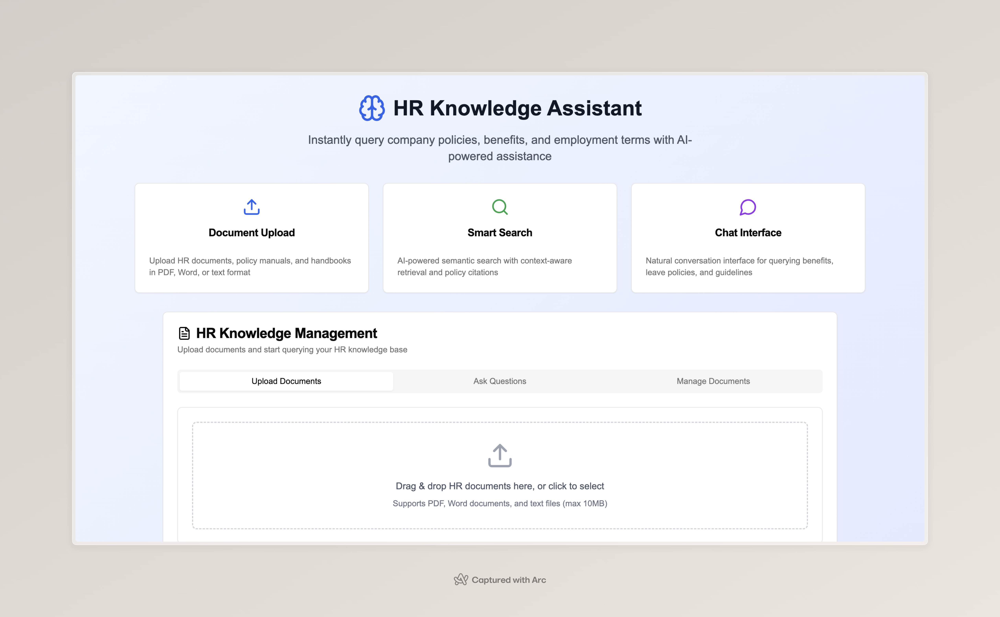

# HR Onboarding Knowledge Assistant

A comprehensive AI-powered HR assistant that replaces time-consuming induction calls with an intelligent system for querying company policies, benefits, leave policies, and employment terms.

## 🚀 Features

- **Document Upload**: Support for PDF, Word docs, and text files
- **Intelligent Processing**: Advanced text extraction and chunking
- **Vector Search**: Semantic search with ChromaDB
- **AI-Powered Q&A**: Natural language queries with Gemini API
- **Source Citations**: Transparent policy references
- **Category Classification**: Automatic query categorization
- **Admin Dashboard**: Document management interface

## 🛠 Tech Stack

### Frontend
- **Next.js 14** - React framework with App Router
- **shadcn/ui** - Modern UI components
- **Tailwind CSS** - Utility-first styling
- **TypeScript** - Type safety

### Backend
- **FastAPI** - High-performance Python API
- **ChromaDB** - Vector database for embeddings
- **Google Gemini API** - Text generation and embeddings
- **LangChain** - Document processing pipeline
- **pdfplumber** - PDF text extraction
- **python-docx** - Word document processing

## 📋 Prerequisites

- Node.js 18+ and npm
- Python 3.11+
- Google Gemini API key

## 🔧 Installation

### 1. Clone the Repository
\`\`\`bash
cd hr-onboarding-assistant
\`\`\`

### 2. Frontend Setup
\`\`\`bash
npm install
\`\`\`

### 3. Backend Setup
\`\`\`bash
cd backend
python3 -m venv venv

# On Windows
venv\Scripts\activate

# On macOS/Linux
source venv/bin/activate

pip3 install -r requirements.txt
\`\`\`

### 4. Environment Configuration
\`\`\`bash
# In backend directory
cp .env.template .env
\`\`\`

Edit `.env` and add your API keys:
\`\`\`env
GOOGLE_API_KEY=your_gemini_api_key_here
CHROMA_PERSIST_DIRECTORY=./data/vector_db
UPLOAD_DIRECTORY=./data/documents
\`\`\`

## 🚀 Running the Application

### Start Backend (Terminal 1)
\`\`\`bash
cd backend
source venv/bin/activate  # or venv\Scripts\activate on Windows
uvicorn app.main:app --reload --host 0.0.0.0 --port 8000
\`\`\`

### Start Frontend (Terminal 2)
\`\`\`bash
npm run dev
\`\`\`

Access the application at `http://localhost:3000`

## 📖 Usage

### 1. Upload Documents
- Navigate to the "Upload Documents" tab
- Drag and drop or select HR documents (PDF, DOCX, TXT)
- Documents are automatically processed and indexed

### 2. Ask Questions
- Switch to "Ask Questions" tab
- Type natural language queries about HR policies
- Get instant answers with source citations

### 3. Manage Documents
- Use "Manage Documents" tab to view all uploaded files
- Filter by category, status, or search by name
- Delete or download documents as needed

## 🔍 Sample Queries

- "How many vacation days do I get as a new employee?"
- "What's the process for requesting parental leave?"
- "Can I work remotely and what are the guidelines?"
- "How do I enroll in health insurance?"
- "What are the performance review procedures?"

## 🏗 Architecture

\`\`\`
┌─────────────────┐    ┌─────────────────┐    ┌─────────────────┐
│   Next.js UI    │───▶│   FastAPI       │───▶│   ChromaDB      │
│   (Frontend)    │    │   (Backend)     │    │   (Vector DB)   │
└─────────────────┘    └─────────────────┘    └─────────────────┘
                              │
                              ▼
                       ┌─────────────────┐
                       │   Gemini API    │
                       │   (LLM/Embed)   │
                       └─────────────────┘
\`\`\`

## 🔐 API Endpoints

- `POST /upload` - Upload and process documents
- `POST /query` - Query the knowledge base
- `GET /documents` - List all documents
- `DELETE /documents/{id}` - Delete a document
- `GET /health` - Health check

## 🐳 Docker Deployment

\`\`\`bash
cd backend
docker-compose up -d
\`\`\`

## 📊 Document Processing Pipeline

1. **Upload** - File validation and storage
2. **Extract** - Text extraction (PDF/DOCX/TXT)
3. **Chunk** - Intelligent text splitting
4. **Embed** - Vector embedding generation
5. **Store** - ChromaDB indexing
6. **Query** - Semantic search and retrieval

## 🎯 Query Categories

- **Benefits** - Insurance, retirement, compensation
- **Leave Policies** - Vacation, sick leave, FMLA
- **Work Policies** - Remote work, schedules, attendance
- **Performance** - Reviews, evaluations, feedback
- **Conduct** - Ethics, harassment, compliance
- **General** - Miscellaneous HR topics

## 🔧 Configuration

### Backend Settings (`backend/app/core/config.py`)
- `CHUNK_SIZE`: Text chunk size (default: 1000)
- `CHUNK_OVERLAP`: Chunk overlap (default: 200)
- `DEFAULT_TOP_K`: Search results count (default: 5)
- `SIMILARITY_THRESHOLD`: Relevance threshold (default: 0.7)

### Frontend Configuration
- CORS origins in backend settings
- API endpoint configuration
- UI theme customization

## 📈 Performance Optimization

- **Chunking Strategy**: Optimize chunk size for your documents
- **Embedding Model**: Consider different embedding models
- **Caching**: Implement response caching for common queries
- **Batch Processing**: Process multiple documents simultaneously

### No Database Required
- Uses ChromaDB locally (no external database needed)
- No authentication system (as requested)
- All data stored locally

### 4. Development Tools
- **Node.js**: https://nodejs.org/
- **Python 3.11+**: https://python.org/
- **Git**: https://git-scm.com/

